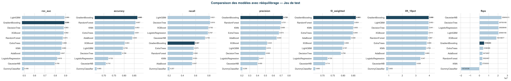

<table>
  <tr>
    <td></td>
    <td><h1>Projet_ML2_G8 — Prédiction du churn bancaire · Fortuneo Bank</h1></td>
  </tr>
</table>


## Résumé exécutif

Ce projet couvre l'ensemble de la chaîne data science pour prédire le **départ volontaire (churn) des clients** de Fortuneo Bank. Il combine ingestion contrôlée, audit de qualité, nettoyage par règles métier, feature engineering structuré, modélisation comparative et optimisation métier via la métrique FBPS (Financial Business Performance Score).

Voir le lien vers la présentation Canva : [Lien_Canva]( https://canva.link/kheknr1ru6rppkj)

Voir le déploiement ici :
[Prediction_churn_bancaire_fortuneo](https://fortuneo-churn-score-frontend.onrender.com/)

## Objectifs et périmètre

- Prédire la variable cible `Exited` (churn binaire) à partir des données clients Fortuneo.
- Maximiser la détection des churners réels (rappel) tout en limitant les faux positifs coûteux.
- Comparer deux stratégies de classification : **seuil par défaut (0.5)** vs **seuil optimisé (0.45)**.
- Intégrer une métrique métier (FBPS) pour évaluer le gain net des campagnes de rétention.
- Garantir la traçabilité (audit automatique, fichiers intermédiaires, métadonnées).

## Données

- **Source** : `Bank_churn.csv` (Google Drive — URL dans `configs/data/paths.yaml`).
- **Volumétrie initiale** : 165 034 lignes, 14 colonnes.
- **Audit et historisation** : `data/metadata.json` (empreinte MD5, horodatage, utilisateur).
- **Données traitées** : `data/processed/data_final.csv` (15 features retenues après feature engineering).

## Pipeline analytique

### 1) Exploration des données — `notebooks/01_notebook_eda.ipynb`

- Analyse univariée et bivariée des 14 variables brutes.
- Analyse du déséquilibre de la variable cible (`Exited`).
- Identification des distributions, corrélations et anomalies.
- Rapports exportés dans `reports/01_notebook/`.

### 2) Traitement & Feature Engineering — `notebooks/02_notebook_processing_feature_engineering.ipynb`

- **Section 4** : traitement des outliers (winsorisation IQR).
- **Section 5** : vérification des contraintes métier (bornes FICO, âge, solde…).
- **Sections 6–7** : construction des variables explicatives et variables dérivées :

  | Variable construite   | Description                    |
  | --------------------- | ------------------------------ |
  | `Balance_per_Product` | Solde moyen par produit détenu |
  | `Tenure_Age_Ratio`    | Ancienneté relative à l'âge    |
  | `Balance_Age_Ratio`   | Ratio solde / âge              |
  | `Salary_Age`          | Interaction salaire × âge      |

- Pipeline paramétré via `configs/feature_engineering/default.yaml`.
- Rapports exportés dans `reports/02_notebook/`.

### 3) Modélisation sans rééquilibrage — `notebooks/03a_notebook_modelisation.ipynb`

- **Critère principal** : F2-weighted (privilégie le rappel).
- **Métriques** : ROC AUC, Accuracy, Recall, Precision, F2-weighted, Lift@10%, FBPS.
- **11 modèles comparés** : DummyClassifier, GaussianNB, Logistic Regression, Decision Tree, KNN, AdaBoost, Random Forest, Extra Trees, Gradient Boosting, XGBoost, LightGBM.
- **Tuning Optuna** (TPE, 50 essais) sur le meilleur modèle.
- Rapports exportés dans `reports/03a_notebook/`.

### 4) Modélisation avec seuil optimisé — `notebooks/03b_notebook_modelisation.ipynb`

- Même pipeline que 03a avec **seuil de classification fixé à 0.45** pour maximiser le rappel.
- Analyse SHAP (TreeExplainer) sur le meilleur modèle :
  - Force plots (profil risque élevé / moyen / faible).
  - Beeswarm plot (importance globale des variables).
- Rapports exportés dans `reports/03b_notebook/`.



## Métrique métier — FBPS

La métrique **FBPS (Financial Business Performance Score)** évalue le gain net d'une campagne de rétention en tenant compte de la valeur financière de chaque client :

```
Vi = 0.05 × Balance + 0.01 × EstimatedSalary

FBPS = Σ(Vi × p_success − Cret)  [Vrais Positifs]
     − Σ Cret                      [Faux Positifs]
     − Σ Vi                        [Faux Négatifs]
```

Implémentée dans `src/metrics/fbps.py` et intégrée dans toutes les évaluations des notebooks 03a et 03b.

## Résultats — Meilleurs modèles

Les artefacts des meilleurs modèles (issus de 03a et 03b) sont sérialisés en trois formats :

| Format | Fichier                                       |
| ------ | --------------------------------------------- |
| joblib | `best_model/gradientboosting_pipeline.joblib` |
| pickle | `best_model/gradientboosting_pipeline.pkl`    |
| dill   | `best_model/gradientboosting_pipeline.dill`   |

Tracking MLflow disponible localement dans `mlruns/`.

## Structure du dépôt

```text
best_model/            # Artefacts du meilleur modèle (joblib, pkl, dill)
configs/               # Configs Hydra (chemins, nettoyage, FE, modèles, MLflow)
data/                  # Raw, interim, processed + metadata.json
figures/               # Graphiques de diagnostics et logo
frontend/              # Interface utilisateur ReactJS (Dashboard Fintech)
mlruns/                # Tracking local MLflow
notebooks/             # Notebooks d'analyse et modélisation
reports/               # Images et synthèses exportées par notebook
src/
├── api/               # API FastAPI servant le modèle pour la prédiction
├── cleaning_steps/    # Étapes de nettoyage des données
├── data/              # Chargement et préparation initiale
├── eda/               # Scripts pour l'analyse exploratoire (EDA)
├── feature_engineering/  # Construction des features (variables dérivées)
├── metrics/           # Métrique FBPS personnalisée
├── models/            # Entraînement et sérialisation des modèles
├── tools/             # Scripts utilitaires divers
└── utils/             # Config, MLflow, logging
test/                  # Tests unitaires pytest
render.yaml            # Configuration de déploiement (plateforme Render)
```

## Démarrage rapide

### 1) Installer les dépendances

```bash
pip install -r requirements.txt
```

### 2) Pipeline data (exemple Python)

```python
from src.utils.config_loader import load_config
from src.data.load_data import load_data_raw
from src.feature_engineering.feature_engineering import run_feature_engineering_pipeline

cfg = load_config()
raw_df = load_data_raw(cfg)
fe_df = run_feature_engineering_pipeline(raw_df, cfg)
```

### 3) Utiliser la métrique FBPS

```python
from src.metrics.fbps import fbps_score

score = fbps_score(
    y_true, y_pred,
    balances=X_test['Balance'].values,
    estimated_salaries=X_test['EstimatedSalary'].values,
    Cret=20,
    p_success=1.0,
)
```

### 4) Lancer les tests

```bash
pytest
```

## Déploiement

- Le déploiement s'est fait via un API fait avec FastAPI qui sert le meilleur modèle entrainé via une interface realisée en avec ReactJS et Vite. La plateforme utilisée pour ce déploiement est _Render_ qui utilise le repository GitHub pour le faire.

## Configuration

- Config principale : `configs/config.yaml` (inclut `data`, `eda`, `cleaning`, `feature_engineering`, `mlflow`).
- Exemple de surcharge Hydra : `load_config(overrides=["data.raw.file=autre_fichier.csv"])`.
- Chemins résolus depuis la racine projet via `PROJECT_ROOT`.

## Qualité & tests

- Tests disponibles : `test/test_feature_engineering.py`, `test/test_mlflow_tracking.py`, `test/test_train_model.py`.
- CI GitHub Actions : `.github/workflows/ci.yml` (Python 3.10, `pytest -q --tb=short`).
- Exécution locale : `pytest`.

## Livrables clés

| Livrable                               | Chemin                                                       |
| -------------------------------------- | ------------------------------------------------------------ |
| Notebook EDA                           | `notebooks/01_notebook_eda.ipynb`                            |
| Notebook Feature Engineering           | `notebooks/02_notebook_processing_feature_engineering.ipynb` |
| Notebook modélisation (base)           | `notebooks/03a_notebook_modelisation.ipynb`                  |
| Notebook modélisation (seuil optimisé) | `notebooks/03b_notebook_modelisation.ipynb`                  |
| Métrique FBPS                          | `src/metrics/fbps.py`                                        |
| Meilleur modèle                        | `best_model/`                                                |
| Rapports et figures                    | `reports/`                                                   |

## Contributeurs

<div align="center">
  <table>
    <tr>
      <td align="center">
        <a href="https://github.com/proslawa">
          
        </a>
        <br />
        proslawa
      </td>
      <td align="center">
        <a href="https://github.com/Sarahlaure">
          
        </a>
        <br />
        Sarahlaure
      </td>
      <td align="center">
        <a href="https://github.com/ameth08faye">
          
        </a>
        <br />
        ameth08faye
      </td>
      <td align="center">
        <a href="https://github.com/ruskovin">
          
        </a>
        <br />
        ruskovin
      </td>
    </tr>
  </table>
</div>
